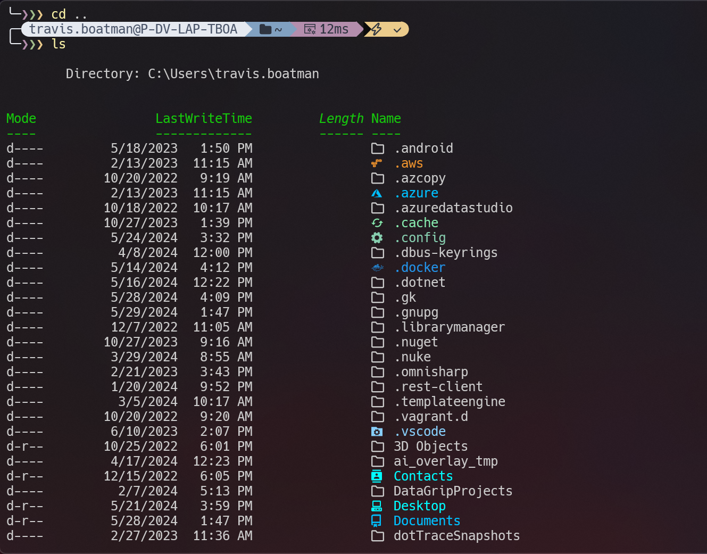
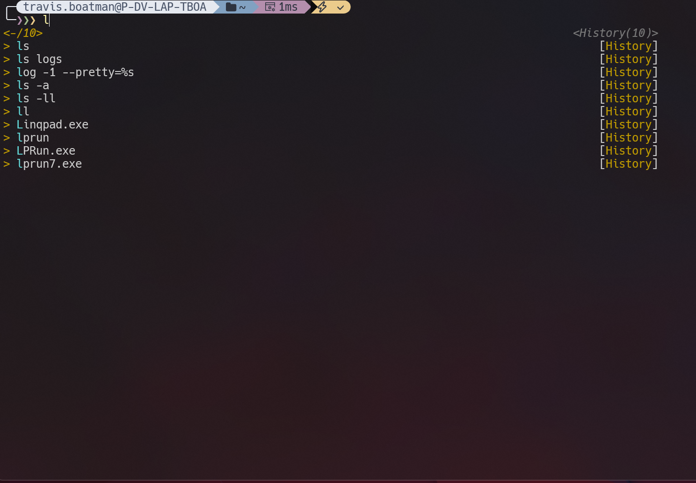

# TB Scripts & Terminal

Scripts I use on a daily basis.

This repository is used as a centralized location for my terminal setup across PCs.
For the most part anyone should be able to use them and use my custom theme and configs. Any paths used are agnostic. Environment varibles and configs are used where needed.

## Modules Used:
* Terminal Icons - Icons in your terminal.
* PSReadLine - Terminal command history.
* gsudoModule - sudo for Windows.
* PSScriptTools - Addtional handy PS scripts.

## Termnial Configuration:
* Oh My Posh
* Nord Terminal Theme (Optional)
* Hack Nerd Font (Optional)
* Quake Terminal (Optional)

# Install
Run `./setup/setup.ps1` follow prompts.
Then `./setup/ps-profile.ps1` follow prompts.

# Uninstall
Run `./setup/uninstall.ps1`.

# Commands
* dto - Creates a private and public DTO event for you and your team.
* delete-fast - Fast delete a directory.
* go - Go to a directory.
* open - Open/Execute an app, file, url, path.
* reload - Reload terminal environment varibles.
* cpu - Shutdown or restart.
* shortcut - Shortcut cheat sheet for Chrome, Firefox, Edge, Terminal, Windows, Visual Studio, VS Code, DataGrip, PyCharm, and Rider.
* npm-creds - Sets a new NPM auth key.
* scrub - Runs Windows disk cleanup.
* vm - Start, Stop, Restart, Checkpoint Hyper-V VMs.

# Additional Scripts

Under `/additional-scripts` or wherever `TB_ADDITIONAL_SCRIPTS` is located you can add more scripts that won't be tracked by git.
These will also be automatically assigned an alias on their file name.

# Python Scripts

Additional scripts in python located under `/py-scripts`, not used on PATH. Used as utility scripts.

# Examples

